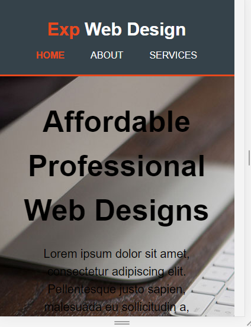
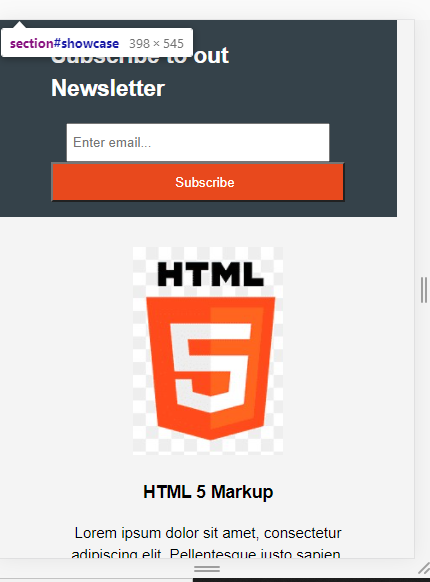
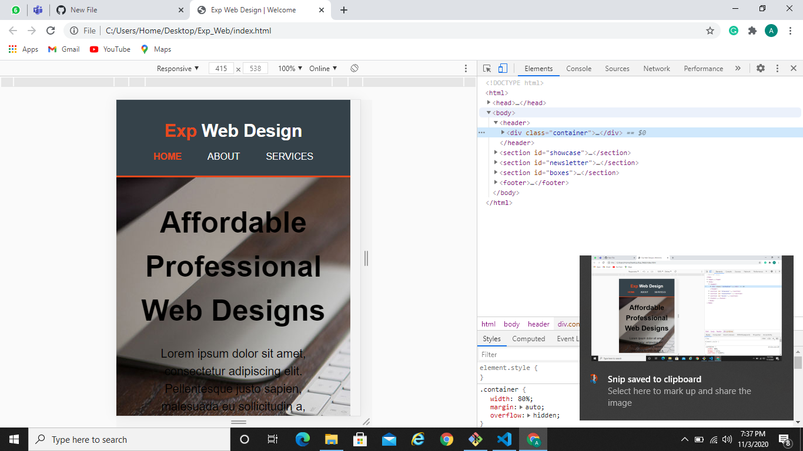

### Business Website Design

This is a responsive template for a business organization.

## Screenshot 1

## Screenshot 2

## Screenshot 3 

### Implementation

-This is a responsive website built using HTML5 and CSS3 for a mock Web Design Organization.

-It comprises of a home page, an about us page and a services page.

-Home page consists of a navigation bar, a newsletter form, a showcase section, a display section and a website footer.

-The About page is has two paragraph tags and a sidebar section.

-The elements of the page adjust themselves according to the width of thedevice on which it is being used.

### Instructions

1. Just open the index.html file.