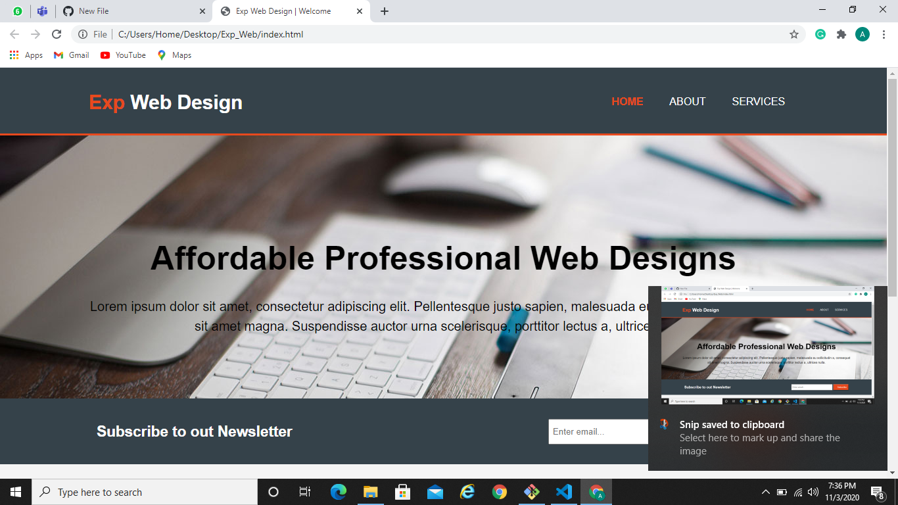

## Business Website Design

Designed a responsive business website from scratch using HTML, CSS and Bootstrap
### Webview

### Mobile view 1

### Mobile view 2 

## Implementation

- This is a responsive website built using HTML5 and CSS3 for a mock Web Design Organization.

- It comprises of a home page, an about us page and a services page.

- Home page consists of a navigation bar, a newsletter form, a showcase section, a display section and a website footer.

- The About page is has two paragraph tags and a sidebar section.

- The elements of the page adjust themselves according to the width of thedevice on which it is being used.

## Instructions

- Just open the index.html file.

## Technologies Used

- HTML 5
- CSS 3
- Bootstrap